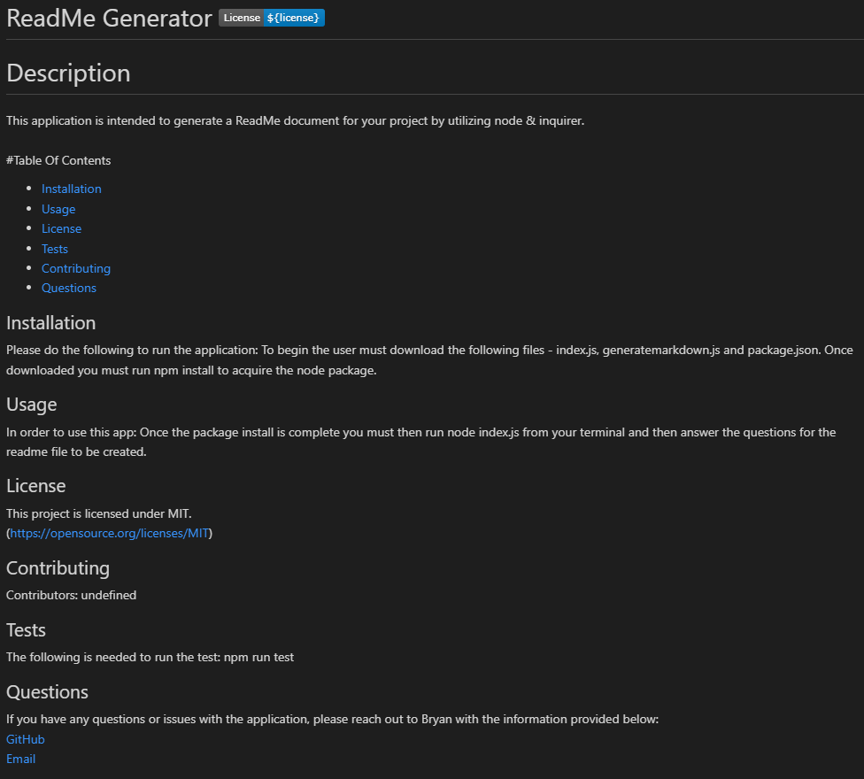

# ReadMe Generator

## Description
This application is intended to generate a ReadMe document for your project by utilizing node & inquirer.
[Click to view video Tutorial](https://watch.screencastify.com/v/A3mXadJTY0qSNbJO3GjL)

## Table of Contents

* [Installation](#installation)
* [Usage](#usage)
* [License](#license)
* [Tests](#tests)
* [Contributing](#contributing)
* [Questions](#questions)

## Installation
***
To begin  the user must download the following files - index.js, generatemarkdown.js and package.json. Once downloaded you must run npm install to acquire the node package.

## Usage
***
Once the package install is complete you must then run node index.js from your terminal and then answer the questions for the readme file to be created.

## License
***
MIT

## Tests
***
Default terminal command "npm run test"

## Contributing
***
Myself, Bryan S.

## Questions
***
https://github.com/bsayavong

If you have any further questions please reach out to my email -

bksayavong@gmail.com

## Credits
***
I used https://gist.github.com/lukas-h/2a5d00690736b4c3a7ba for the license badges and links & https://www.npmjs.com/ for documentation on the packages.